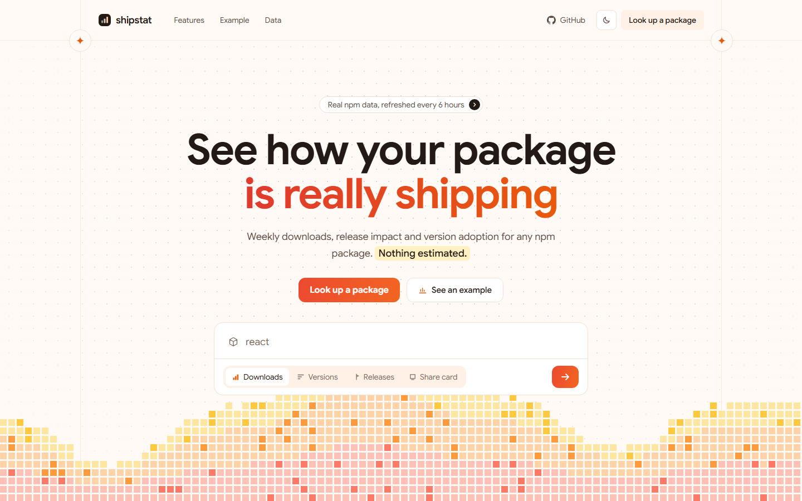
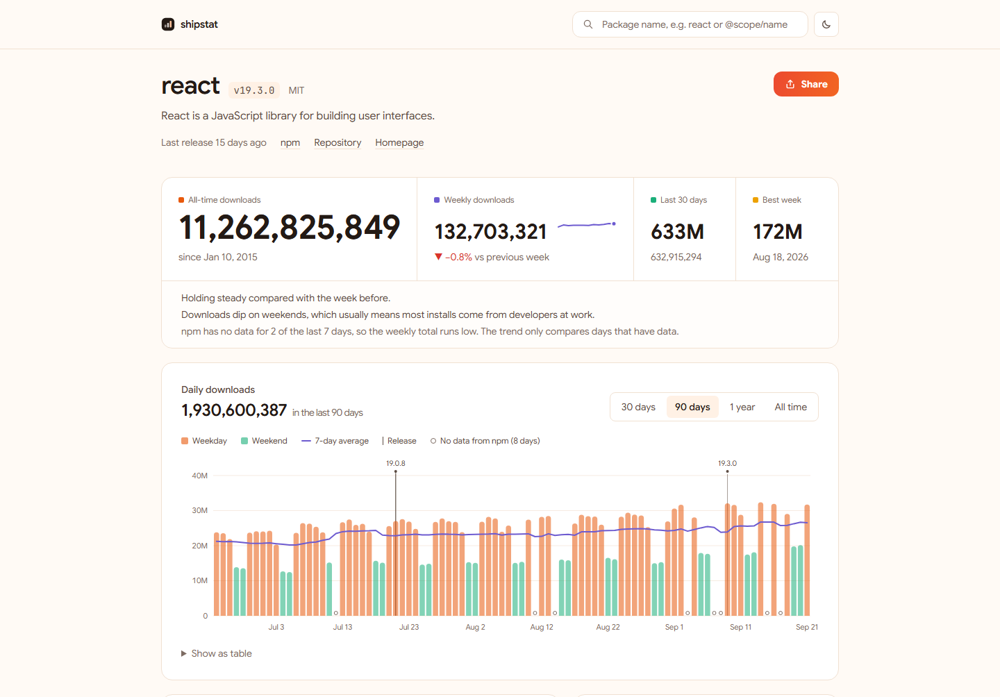
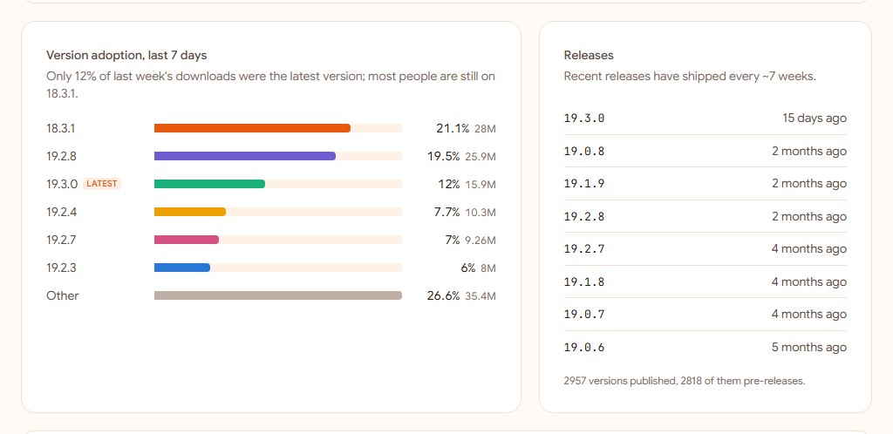
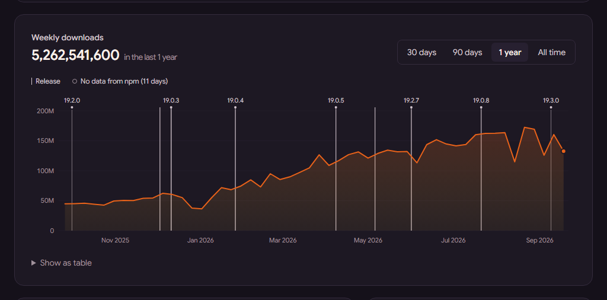
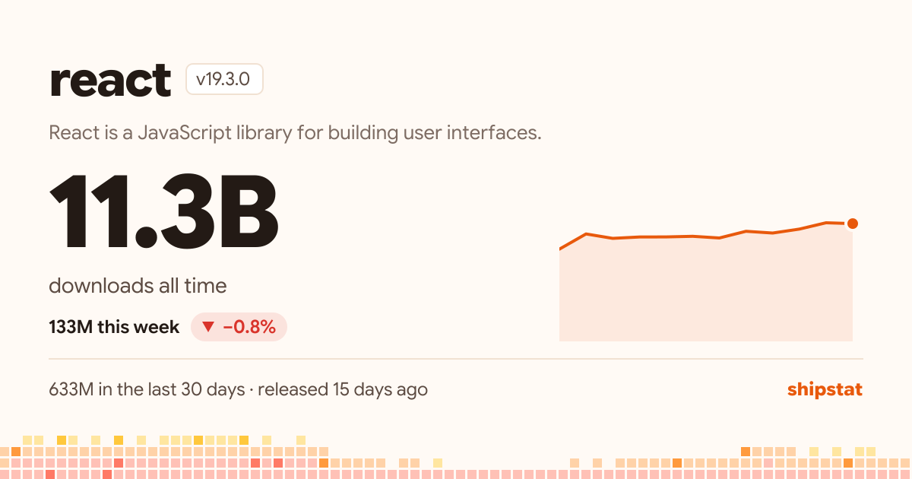
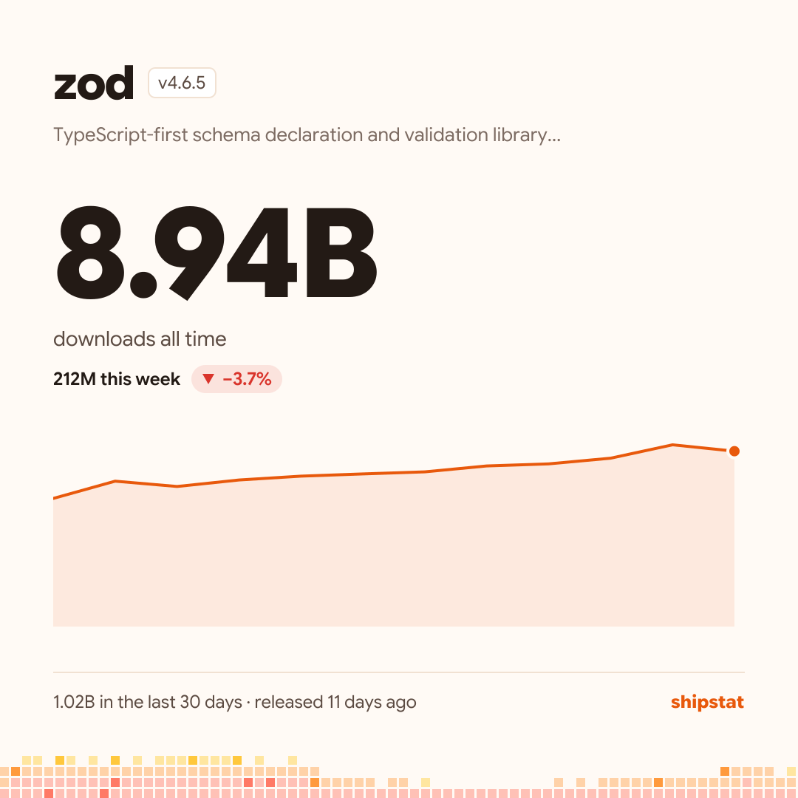
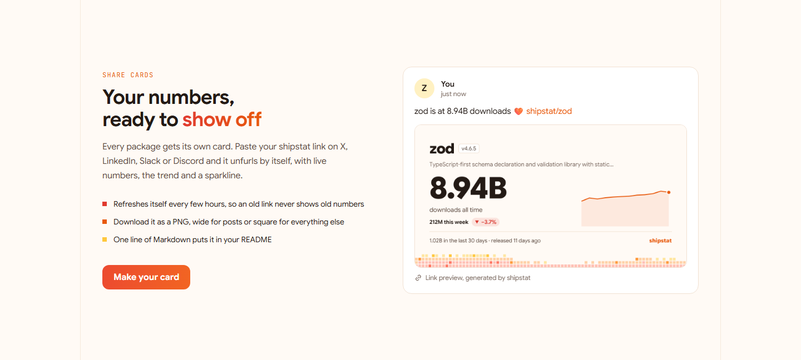
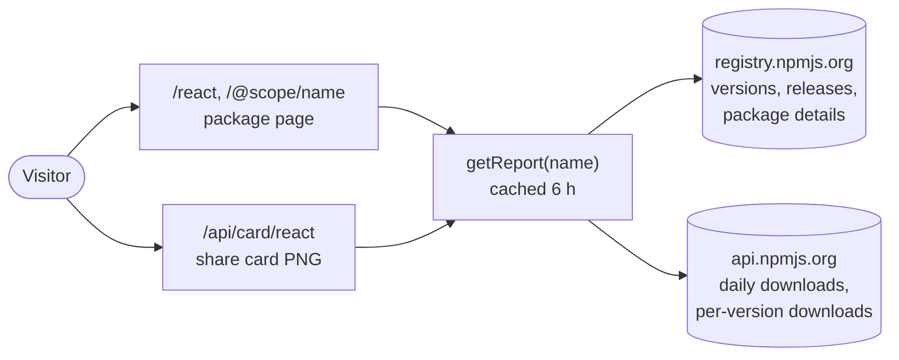

<p align="center">
  <picture>
    <source media="(prefers-color-scheme: dark)" srcset="docs/images/landing-dark.png">
    
  </picture>
</p>

<h1 align="center">shipstat</h1>

<p align="center">
  <b>Honest download stats for any npm package.</b><br>
  All-time and weekly downloads, release impact, version adoption and a card worth sharing.<br>
  Straight from npm. Nothing estimated.
</p>

<p align="center">
  
  
  
  
  
</p>

---

## Why

Checking how a package is doing usually means hand-typing URLs like
`api.npmjs.org/downloads/point/2026-07-23:2026-09-23/your-package`, or using a dashboard that pads the
numbers out with guesses. Some even draw "global download" maps, but npm publishes no location data at all.

shipstat shows only what npm actually reports, and explains what the numbers mean.

## What you get

<p align="center">
  
</p>

- **All-time downloads up front,** with weekly downloads, week-over-week trend, the last 30 days and the best week next to them.
- **A chart that explains itself.** Daily bars split into weekdays and weekends, a 7-day average, and a marker for every release, so the jump after `v2.0` is right there. Switch between 30 days, 90 days, 1 year and all time. Every point has a hover tooltip, keyboard support and a table view.
- **Plain-English insights,** such as *"Downloads dip on weekends, which usually means most installs come from developers at work."*
- **Honest about npm's data gaps.** npm sometimes reports a whole day as 0 for every package. shipstat marks those days instead of drawing them as a crash, and leaves them out of trends.

<table>
  <tr>
    <td width="50%"></td>
    <td width="50%"></td>
  </tr>
  <tr>
    <td><b>Version adoption and releases.</b> See how much of last week's traffic already runs your latest release, and how often you ship.</td>
    <td><b>Light and dark.</b> Light by default, with a warm dark theme a click away. Every chart colour is checked for contrast and colour-blind safety in both.</td>
  </tr>
</table>

## Share cards

Every package gets its own card. Paste a shipstat link on X, LinkedIn, Slack or Discord and it unfurls by
itself. The card also downloads as a PNG, wide or square.

<p align="center">
  
  &nbsp;
  
</p>

Put it in your README with one line:

```md
[](https://your-shipstat-domain/your-package)
```

<p align="center">
  
</p>

## How it works



- **One cached report per package.** `src/lib/report.ts` pulls everything a page needs from npm, computes the
  stats once and caches the result for 6 hours. Pages render on first visit and are then served from cache (ISR),
  so a popular package costs a few npm requests every 6 hours, however many people view it.
- **History in fixed windows.** npm's range endpoint silently cuts off anything longer than about 18 months, so
  history is fetched in fixed 500-day windows. Windows fully in the past never change, so they're cached for a week.
- **Gap detection.** A zero in the middle of an otherwise busy stretch is treated as missing data, not a real
  zero (`src/lib/series.ts`).
- **Built to stay up.** Requests that npm rate-limits (429) or that fail with a 5xx error are retried, a failing
  "latest day" lookup falls back to npm's usual lag, and a share card whose font fails to render falls back to a
  built-in one.
- **Cards that don't go stale.** Card URLs carry a version, and browsers always check for a fresh card, while the CDN caches each one for 6 hours.

| Route | What it does |
| --- | --- |
| `/` | Landing page with search, live preview and share-card showcase |
| `/<package>`, `/@scope/<package>` | Package page (anchors: `#downloads`, `#versions`, `#releases`, `#share`) |
| `/api/card/<package>` | Share card PNG. `?format=square` for 1080×1080, `?download=1` to download |
| `/api/search?q=` | npm search, used by the autocomplete |

## Run it locally

```bash
git clone https://github.com/AnanthuNarashimman/shipstat.git
cd shipstat
npm install
npm run dev
```

Then open [localhost:3000](http://localhost:3000) and search for any package.

## Deploy

shipstat is a single Next.js app, so the frontend and backend deploy together. On Vercel, import the repo and
deploy; no configuration is needed, and it fits comfortably in the free tier thanks to the caching above.

Optional environment variables (see [`.env.example`](.env.example)):

| Variable | Purpose |
| --- | --- |
| `NEXT_PUBLIC_SITE_URL` | Public URL for share links and link previews. On Vercel it defaults to your production domain. |
| `UPSTASH_REDIS_REST_URL`, `UPSTASH_REDIS_REST_TOKEN` | Turns on the "packages analyzed" counter. The Vercel Marketplace Upstash integration sets `KV_REST_API_*`, which also works. |

## Project structure

```
src/
├── app/
│   ├── page.tsx                  landing page
│   ├── [...pkg]/page.tsx         package page
│   ├── api/card/[...pkg]/        share card image
│   └── api/search/               npm search proxy
├── components/
│   ├── DownloadsChart.tsx        the main chart (SVG, no chart library)
│   ├── VersionAdoption.tsx, ReleaseList.tsx, SharePanel.tsx, SiteFooter.tsx …
│   └── landing/                  hero search, pixel waves, live preview, card showcase
└── lib/
    ├── npm.ts                    npm registry and downloads API client
    ├── report.ts                 builds and caches the per-package report
    ├── series.ts                 gap detection, weekly buckets, averages
    └── insights.ts               the plain-English summaries
```

## Built with

[Next.js 16](https://nextjs.org) (App Router, ISR, `next/og`) · React 19 · TypeScript · Tailwind CSS 4 ·
Google Sans and JetBrains Mono. Charts are hand-written SVG.

---

<p align="center">
  <sub>Data from the npm registry and downloads API. shipstat is not affiliated with npm, Inc.<br>
  Download counts include CI runs, mirrors and bots, so they measure installs, not people.</sub>
</p>
